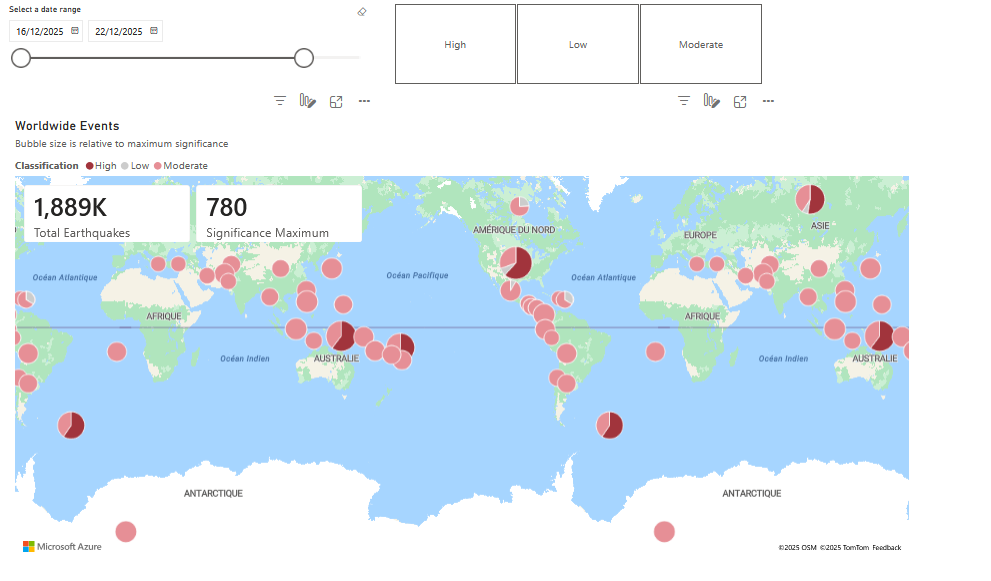

# End-to-End Data Engineering Project with Microsoft Fabric

## 🚀 Project Overview
This project demonstrates the design and implementation of an end-to-end
data engineering pipeline using **Microsoft Fabric**.
The objective is to ingest raw data, store it in a Lakehouse, transform it
using PySpark, and visualize insights using Power BI.

The project follows modern **ELT architecture** and best practices used
in real-world data platforms.

---

## 🏗️ Architecture Overview
The pipeline is composed of the following layers:

1. **Data Source**
2. **Data Ingestion**
3. **Raw Storage (Bronze Layer)**
4. **Data Transformation (Silver & Gold Layers)**
5. **Analytics & Visualization**

---

## 📥 Step 1: Data Source
- Public external data source (API / JSON data)
- Data retrieved in semi-structured format
- Represents raw operational data to be analyzed

---

## 🔄 Step 2: Data Ingestion (Data Factory)
- Microsoft Fabric **Data Factory** is used to orchestrate data ingestion
- A pipeline is created to:
  - Extract data from the source
  - Store the raw data in OneLake
- The pipeline can be scheduled or triggered manually

---

## 🗄️ Step 3: Raw Data Storage (Bronze Layer)
- Raw data is stored in **OneLake (Lakehouse)** under the `Files/` directory
- Data is kept **unchanged** to preserve the original source
- File formats used: JSON / CSV

This layer acts as the **single source of truth**.

---

## ⚙️ Step 4: Data Transformation (PySpark – Silver Layer)
- PySpark notebooks are used for data processing
- Operations performed:
  - Schema inference and validation
  - Data cleansing (nulls, duplicates, invalid values)
  - Type casting and standardization
  - Basic filtering and enrichment

Processed data is stored in a **clean and structured format**.

---

## 🥇 Step 5: Curated Data (Gold Layer)
- Business-ready datasets are created
- Aggregations and metrics are calculated
- Optimized tables are prepared for analytics consumption
- Stored as Lakehouse tables for easy access by Power BI

---

## 📊 Step 6: Data Visualization (Power BI)
- Power BI connects directly to the Lakehouse
- Data model is created using curated tables
- Interactive dashboards include:
  - KPIs
  - Trends
  - Filters and slicers
- Enables business users to explore insights easily

---

## 🛠️ Technologies Used
- Microsoft Fabric
- Data Factory
- OneLake / Lakehouse
- PySpark
- Power BI

---

## 📌 Key Learnings
- Designing an end-to-end ELT data pipeline
- Working with Microsoft Fabric ecosystem
- Using PySpark for scalable data transformations
- Implementing layered architecture (Bronze, Silver, Gold)
- Building analytics-ready datasets for Power BI

---

## 📊 Dashboard Preview

